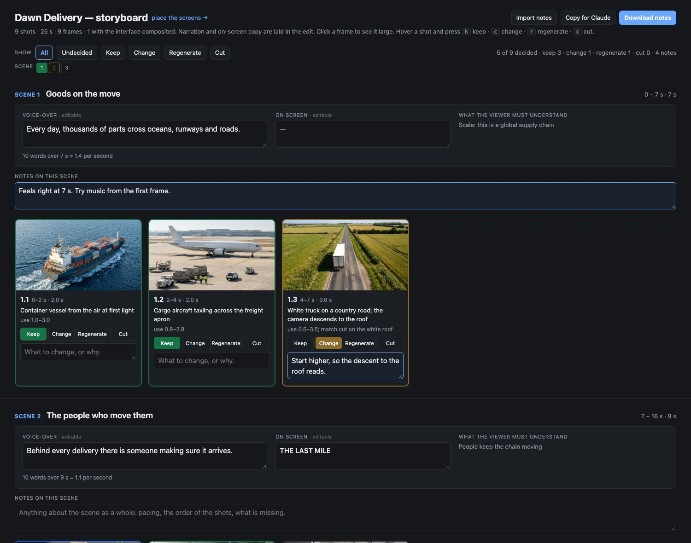
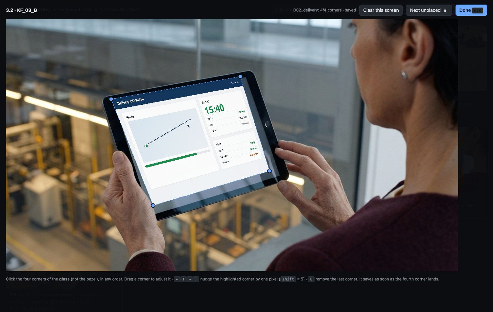

# higgsfield-seedance

A [Claude Code](https://claude.com/claude-code) plugin that turns Claude into a director, prompt writer and production manager for AI video on [Higgsfield](https://higgsfield.ai): **ByteDance Seedance 2.5 and 2.0**, **Higgsfield Cinema Studio**, and the image models that feed them (Soul, Nano Banana, GPT Image, Seedream), all driven through the `higgsfield` CLI.

You describe what you want in plain language. Claude directs the shot, writes a prompt that holds up over a long take, checks it locally, tells you the price before anything is spent, runs it and hands you the result. For a whole film it plans every shot, keeps characters and places consistent, builds a storyboard page you can review and annotate, and spends credits only behind gates you approve.


## Why it exists

Most bad AI video comes from how the prompt is built, not from the settings: beats that merge or vanish, left and right flipped, lenses drifting, invented lettering on clothes, a character who becomes a different person in the next shot, endings that freeze. And most wasted credits come from generating before deciding.

The plugin fixes both:

- **It directs before it writes.** Blocking, gaze, screen direction, lens, light and one clear action per clip, then a prompt in the shape the model follows best.
- **It checks before it spends.** A local linter catches the known failure patterns, and the price is confirmed with a free CLI call. You always see the cost first.
- **It plans before it generates.** Shot list, reference library, storyboard, budget scenarios and approval gates, so a 90-second film does not run out of credits at scene 12.

## What you can do with it

| Command | What it does | Spends credits? |
|---|---|---|
| `/higgsfield-seedance:generate` | One clip from a brief: model and mode, prompt, lint, free price check, run, deliver | Yes, after showing you the cost |
| `/higgsfield-seedance:prompt` | Write, fix, review or lint a video prompt, including the acting | Never |
| `/higgsfield-seedance:image` | Keyframes, character and location references, props and image edits, each routed to the right image model | Yes, after showing you the cost |
| `/higgsfield-seedance:studio` | Cinema Studio 4.0, 3.5, 3.0 and Image 2.5 from the CLI, with look controls: genre, era, tempo, camera, lens, light, palette | Yes, after showing you the cost |
| `/higgsfield-seedance:plan` | Plan a multi-scene film: shot list, asset bible, storyboard page, face tests, budget, gates, run scripts | No, planning only |
| `/higgsfield-seedance:edit` | Edit, extend, chain past 30 s, join or upscale an existing clip | Yes, after showing you the cost |

Type a command with a description after it, or just describe what you want and Claude picks the right action.

## Examples

### A single clip

```
/higgsfield-seedance:generate a 12 s aerial of a container ship at first light, the camera
descending toward the bow, real ocean sound
```

Claude picks the model and mode, writes the prompt, lints it, shows you the price from `higgsfield generate cost`, and runs it only after you say yes. You get the URL, the settings and the credits spent.

### Fix a prompt that keeps failing

```
/higgsfield-seedance:prompt review this: "A woman walks to the left and looks at the camera,
no blur, no text, cinematic, 4k, epic. She picks up the phone, answers it, then runs out
of the door and drives away. Nike shoes."
```

The linter is the first pass, and you can run it yourself:

```
$ python3 scripts/preflight.py prompt.txt --duration 4 --mode omni_reference
ERROR  mode omni_reference needs at least one reference or a start/end frame; use t2v for text only
WARN   mentions 'looks at the camera'; even as a prohibition it can summon the look. Give the eyes a target instead ('eyes on the pallet trucks')
WARN   real brand/model name 'Nike' can pull in real liveries or logos and trigger ip_detected; describe the type instead
```

Claude then rewrites it: one action that fits 4 seconds, positive phrasing instead of "no X" lists, a named target for the eyes, the shoes described by type, and settings moved onto the command where they belong. It names the rule behind every change.

### A consistent character across shots

```
/higgsfield-seedance:image a master portrait of a ferry deckhand in her late fifties, then a
left profile and a full-body view for keyframes
```

The portrait is made first and approved. Every other view and every keyframe is then built with it attached as a reference, one view per person per frame, and each approved pick is recorded in a manifest so later runs can never pick up a rejected candidate. The reference files carry the rules that save re-rolls: plain unbranded clothing, why a strong jacket colour spreads to the trousers and how to stop it, why profiles should be generated once and mirrored, and what to do when a job fails with no reason.

### A whole film

```
/higgsfield-seedance:plan  (paste your storyboard or script: scenes, durations, voice-over,
recurring characters)
```

Planning spends nothing. You get a folder you can run from:

- **`plan.md`**: what was changed from your brief and why, which model handles which shot, the asset bible with one exact description line per character, object and place, budget scenarios against your real credit balance, the run order and the open questions.
- **`shotlist.csv`**: one row per clip with film timings, cut windows and the single action each clip carries. A checker validates that timings run continuously and estimates the cost:

```
$ python3 scripts/shotlist_check.py shotlist.csv --film-seconds 25
OK     9 rows, timeline runs continuously to 25 s
OK     rows by model: seedance_2_5 8, post 1
OK     generated seconds: seedance_2_5 32
OK     first-pass video estimate ≈ 96 credits (2.5, 4.0 and 3.x at 480p, 2.0 at 720p; before re-rolls, stills and finals; confirm with `higgsfield generate cost`)
```

- **Prompts and keyframe prompts**, one file per clip, all linted, with shared framing specs copied word for word so match cuts actually match.
- **Run scripts per act** that lint, price, run one canary clip alone, then batch, with numbered takes, a dry-run mode and a y/N confirmation before every paid step.
- **`storyboard.html`**, described next.

Work then moves through gates: free prep, canary tests, the cast approved side by side, a cheap draft storyboard, keyframes, draft clips at 480p, picture lock, finals, post. Each gate waits for you.

### The storyboard page

Every planned film gets a `storyboard.html` the moment its shot list exists, even before a single image is made. It is a plain file that opens in your browser, with no server and no account.



- **The film as a document.** Scenes in order with their timings, the voice-over, the on-screen copy, what the viewer must understand, and every shot with its frame and cut window.
- **Decide per shot.** Keep, Change, Regenerate or Cut, with a note. Hover a shot and press `k`, `c`, `r` or `x`. Click a frame to see it large and walk the film with the arrow keys.
- **Edit the words in place.** Rewrite the voice-over or on-screen copy and the page checks the pace in words per second against the scene's length.
- **Nothing is lost.** Notes are kept in the browser per project, survive a refresh, and follow their frame if shots are renumbered.
- **Hand it back.** *Download notes* or *Copy for Claude*, and Claude applies every decision to the script, the prompts and the shot list, then rebuilds the page.

```bash
python3 scripts/storyboard.py --project my-film --open
```

### Real interfaces on screens

Image and video models cannot draw a believable user interface, and real product names do not belong in prompts. So every screen in a frame is generated as plain dark glass, and the interface is added afterwards. Build your screens as HTML or use your own screenshots, then click the four corners of the glass:



The corners can be clicked in any order, dragged, or nudged with the arrow keys. The compositor warps the interface into perspective and brings the plate's own reflections back over it, so it sits in the shot instead of floating on top:


```bash
./place-screens.sh                       # opens the placing page
python3 ui/composite.py --pull --all     # composites every placed screen
```

This is compositing for the storyboard. The film's final compositing is done in your editor, from the same images.

### Extend, chain and finish

```
/higgsfield-seedance:edit extend this clip by 8 s, she keeps walking and the camera holds
```

Chains clips past the 30-second limit using the last frame of each take, edits an existing clip, joins takes and upscales approved drafts, so you draft cheaply at 480p and pay for resolution only on what made the cut.

### Cinema Studio looks

```
/higgsfield-seedance:studio a 6 s night street scene, 1970s thriller, anamorphic lens, sodium light
```

Chooses the Cinema Studio engine, sets the look controls by name, and harvests the control IDs from your own job history so the CLI can use the same options as the web app.

## Install

### From GitHub

```bash
claude plugin marketplace add hugojsfranca/higgsfield-seedance
claude plugin install higgsfield-seedance@hugojsfranca
```

Start a new Claude Code session. To pick up later changes:

```bash
claude plugin marketplace update hugojsfranca && claude plugin update higgsfield-seedance@hugojsfranca
```

### For local development

Clone the repo anywhere and link it into your skills folder. Claude Code loads it as a plugin (`higgsfield-seedance@skills-dir`), and edits take effect in the next session with no reinstall:

```bash
git clone https://github.com/hugojsfranca/higgsfield-seedance.git
ln -s "$PWD/higgsfield-seedance" ~/.claude/skills/higgsfield-seedance
```

Check it with `claude plugin details higgsfield-seedance`. Don't use both install methods at once, or the actions appear twice.

## Requirements

- **Higgsfield CLI**, signed in: `curl -fsSL https://raw.githubusercontent.com/higgsfield-ai/cli/main/install.sh | sh`, then `higgsfield auth login`.
- **python3** for the linter and planning tools. They use only the standard library.
- **ffmpeg** for last frames, trims and joins.

## What's inside

| Path | Purpose |
|---|---|
| `docs/images/` | Pictures used in this README |
| `.claude-plugin/` | Plugin manifest, and a marketplace file so this repo installs directly |
| `skills/generate/` | Routing (2.5 vs 2.0), brief, modes, one take vs one clip per shot, price, run, deliver, errors |
| `skills/prompt/` | Shot direction, prompt shape, the 18 rules (including performance), faces, keyframe prompts, preflight |
| `skills/image/` | Image model routing, still-prompt rules, Soul ID, edits, lint, price and run |
| `skills/studio/` | Cinema Studio engine routing, look controls and control IDs, price and run |
| `skills/plan/` | Film workflow: brief review, routing, shot list, asset bible, budget, gates, review |
| `skills/edit/` | Edit, extend, chain, upscale and join |
| `references/prompt-patterns.md` | Five prompt shapes with worked examples, and camera language |
| `references/shot-direction.md` | Blocking, gaze, screen direction, optics, lighting, cut types, dialogue |
| `references/acting.md` | Performance as behaviour: beats scaled to clip length, body and eye acting, dialogue and voice lines, acting profiles, failure atlas |
| `references/image-prompts.md` | Image models on the CLI with prices, routing, rules, building blocks, templates and the edit method |
| `references/cinema-studio.md` | Cinema Studio engines on the CLI with prices, every control and its values, defaults that bite, folders, commands and first tests |
| `references/first-last-frame.md` | Start/end-frame transitions |
| `references/edit-extend-chain.md` | Edit and extension prompts, chaining past 30 s |
| `references/film-planning.md` | Pipeline and gates, shot-list format, asset bible, face tests, budget, resolution strategy |
| `scripts/preflight.py` | Lints a video prompt against its settings, or a still (`--image`, `--sheet`, `--edit`) |
| `scripts/shotlist_check.py` | Validates a film shot list: timing, durations, modes, missing prompts, credit estimate |
| `scripts/optics.py` | Frame size for a lens at a distance, to sanity-check scale in a prompt |
| `scripts/assets.py` | Records approved reference images and resolves asset IDs to exactly one file |
| `scripts/film_run_template.sh` | Staged run script for one act, for Seedance and Cinema Studio: lint, cost, canary, clips, upscale, gates |
| `scripts/studio_ids.py` | Harvests Cinema Studio control IDs (camera, lens, genre, era, tempo, light, palette) from your own job history |
| `scripts/last_frame.sh` | Extracts a clip's last frame for chaining |
| `scripts/storyboard.py` | Builds `storyboard.html` for a film project from its shot list: scenes, timings, voice-over, on-screen copy and frames, with a decision and a note per shot, kept in the browser and exported for Claude. Every planned film gets one |
| `scripts/screens/` | `corners.html`, `composite.py` and `place-screens.sh`: place real interface screenshots on the blank screens of the plates by clicking four corners, then composite them for the storyboard |

The scripts also run on their own:

```bash
python3 scripts/preflight.py prompt.txt --duration 12 --mode omni_reference --start-image
python3 scripts/shotlist_check.py shotlist.csv --prompts prompts --keyframes keyframes
python3 scripts/optics.py 85mm 3m
python3 scripts/storyboard.py --project my-film --open
```

## Notes

- Model facts (modes, durations, limits) were checked against `higgsfield model get` in September 2026, and prices with `higgsfield generate cost` on 17 September 2026. Prices change: always run `generate cost` before spending. If the CLI disagrees with the plugin, trust the CLI.
- The linter's checks are heuristics: fix every ERROR and judge each WARN.
- The people, places and interfaces in the pictures above are generated or invented for illustration.
- Nothing is generated without your go-ahead. Before the first paid job in a session, and before every batch, Claude shows the prompt, the settings and the cost, and waits.

## Credits

- Built from the Seedance 2.5 prompting skill by [InstaSD](https://www.instasd.com/post/seedance-2-5-claude-prompting-skill) (v1.1), then substantially reworked and extended for Higgsfield. Some examples in `references/prompt-patterns.md` come from that skill.
- `references/shot-direction.md` is adapted from Higgsfield's CINEDANCE V4 prompt-director guide for Seedance.
- `references/acting.md` is adapted from Higgsfield's ACTING SYSTEM guide for character performance in Seedance 2.0.
- `references/image-prompts.md` and the image action are adapted from Higgsfield's LIRA image-prompt guide, with models and prices checked against the Higgsfield CLI.

## License

[MIT](LICENSE)
